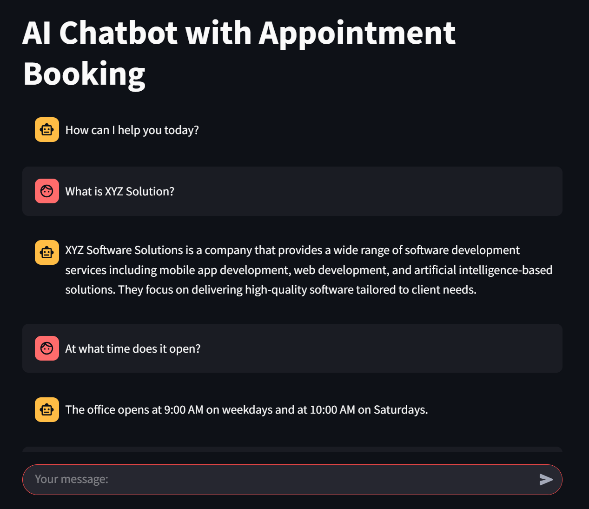
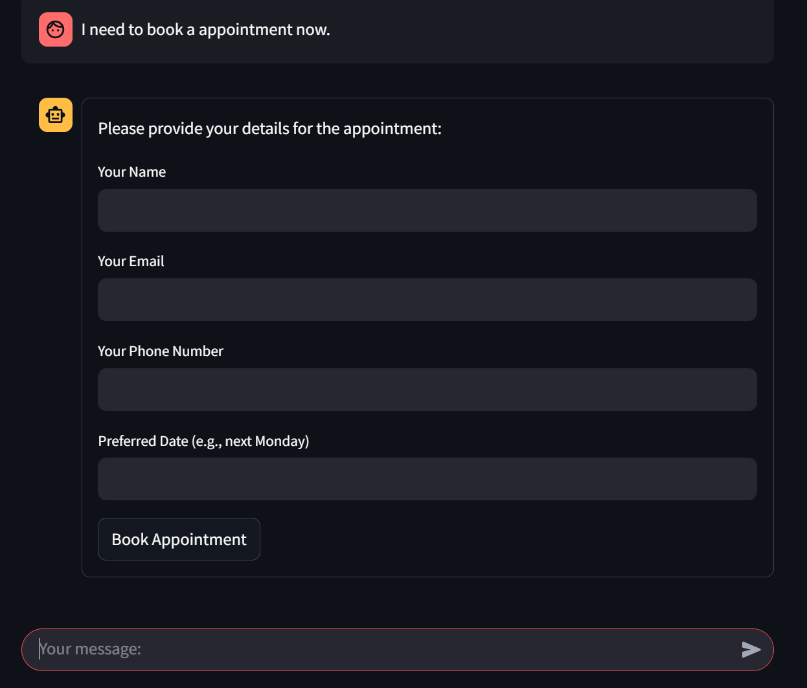
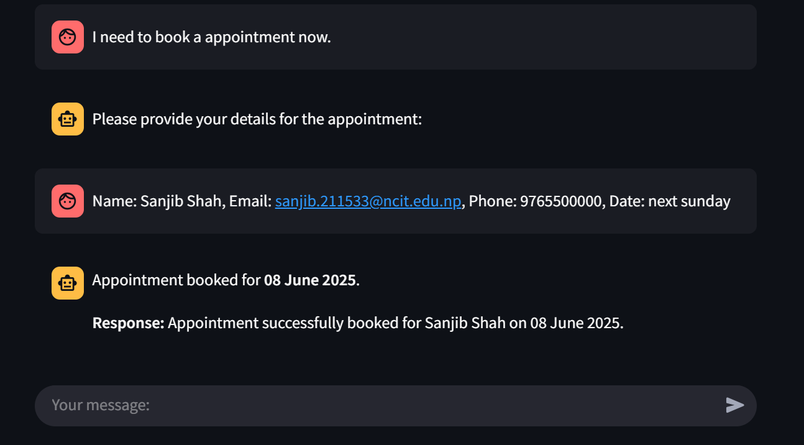
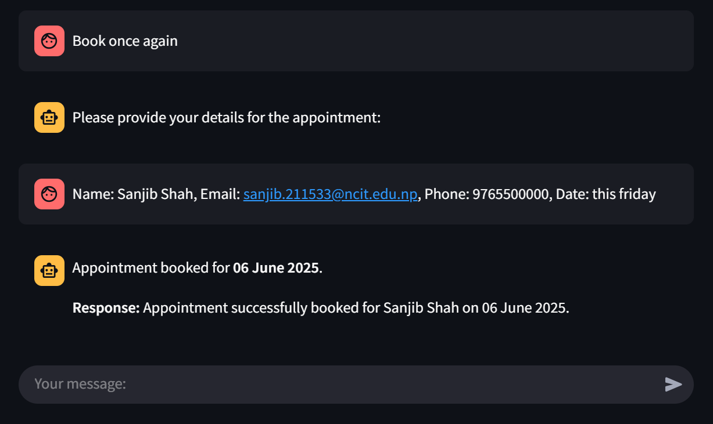

# 🤖 AI Assistant Chatbot with Appointment Booking

This is a conversational chatbot web application built using **Streamlit**, **LangChain** and **OpenAI**. It can answer queries based on documents(currently using sample txt file for testing) and allows users to **book appointments** via a conversational form interface.

---

## Features

- **Natural Chat Interface** using `st.chat_input()`
- **Question Answering** from a document (`sample.txt`) using Vector Embeddings
- **Appointment Booking Form** triggered via conversation
- **Email and Phone Number Validation**
- **Memory Support** for continuous conversation
- Powered by **LangChain Agents**, **Hugging Face Open Source Model** and **OpenAI GPT-4o-mini**

---

## How It Works

1. Users can chat with the AI Assistant.
2. When the user types phrases like `book` or `call me`, the assistant will prompt a form to collect details.
3. The date input is interpreted using LLM to extract structured formats.
4. Appointments are "booked" via a custom LangChain tool.

---


## 🚀 Getting Started

### 1. Clone the Repository

```bash
git clone https://github.com/sanjib7777/Chatbot_with_appointment.git
cd Chatbot_with_appointment
```
### 2. Create a Virtual Environment 

```bash
python -m venv venv
venv\Scripts\Activate
```
### 3. Install Dependencies

```bash
pip install -r requirements.txt
```
### 4. Set Environment Variables

```bash
OPENAI_API_KEY=your_openai_key
HUGGINGFACEHUB_API_TOKEN = your_huggingface_key
```
### 5. Run the App

```bash
streamlit run app.py
```
## Future Improvements

- Add database support for storing appointments
- Integrate real-time notifications (email/SMS)
- Improve output quality by switching to premium models (e.g., GPT-4o, gemini)  
  > Currently using open-source embeddings from Hugging Face 

---

## 📸 Screenshots

<p align="center">
  
  
</p>

<p align="center">
  
  
</p>


